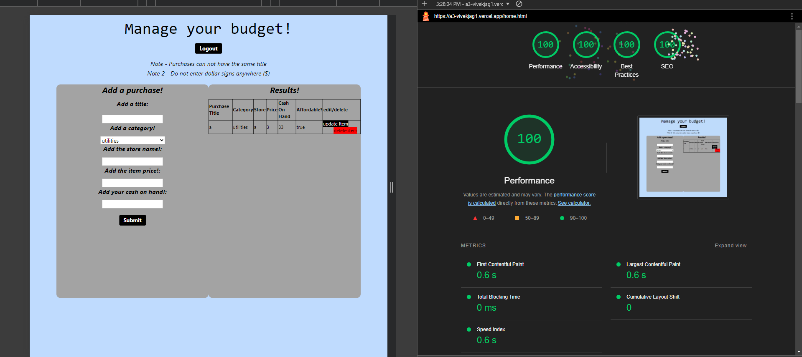

## An Application for managing budgets
Made by Vivek Jagadeesh for CS 4241 -- https://a3-vivekjag1.vercel.app/

## Note to the grader: 
    To make this work with vercel I had to make the following changes to the repo: 
        1. I had to make an api folder and rename server.js to index.js (its still using express, but vercel needs it to be names index.js for the api to be hosted)
        2. My index.html was renamed to home.html after changing the project structure due to adding OAuth via passport.js
        3. All express routes are in the routes directory and separated by file. 
        4. The derived field function is in the utils directory. 

## The challenges in building this application were: 
1. Setting up to repository to work with vercel (See above)
2. Refactoring the entire front-end to work with tailwindcss 
3. Refactoring the entire backend to work with express
## Use of mongoose
- I used mongoose for this app. I think that the mongoose object wrapper is better than the node drivers and I hate working with schema-less databases. 
  
## Authentication method 
1. I used OAuth via Passport.js with "sign in with GitHub". I chose passport for a couple of reasons: 
    1. I have used passport in my personal coding projects. 
    2. There is excellent documentation on passport.
    3. The course staff has github logins and can easily use the app. 
## CSS framework 
1. I chose tailwindcss as my CSS framework for a couple of reasons 
    1. I have LOTS of familiarity with tailwind (more than actual css)
    2. The utility classes make it nearly impossible to make things look particularly bad. 
    3. It was easy to setup/install 
2. I made a couple small modifications 
    1. I personally don't like the way that styling tables works in tailwind, and prefer to write my own css for styling tables. I used a simple border with a 1px black border around the table headers, rows, and the table itself. 

## Technical Achievements.
1. I used OAuth Authentication via the GitHub strategy. (this was difficult to setup and required 3 extra APIs)
2. Deployment with vercel rather than glitch. 
    1. There was nothing I preferred in Glitch to vercel. Vercel allows you to import a git repository and build a CI/CD pipeline so that code automatically deploys upon a push to main. It also gives you a very usable url and has a very generous free tier (I have used vercel as an alternative to AWS and Azure in the past)
3. 100% on the lighthouse test 

## Design Achievements
1. Use of the CRAP principles
   1. Contrast - I used a gray background on the input form to contrast with the blue background of the site.
   2. Repetition - I repeated the same font type and style in both of the forms.
   3. Alignment - I aligned all the form elements and all then the elements in the table together to clearly distinguish the two. 
   4. Proximity - I used proximity to position the results tab and the input tab relatively close to each other so that it was obvious that the two were related, but not exactly the same

